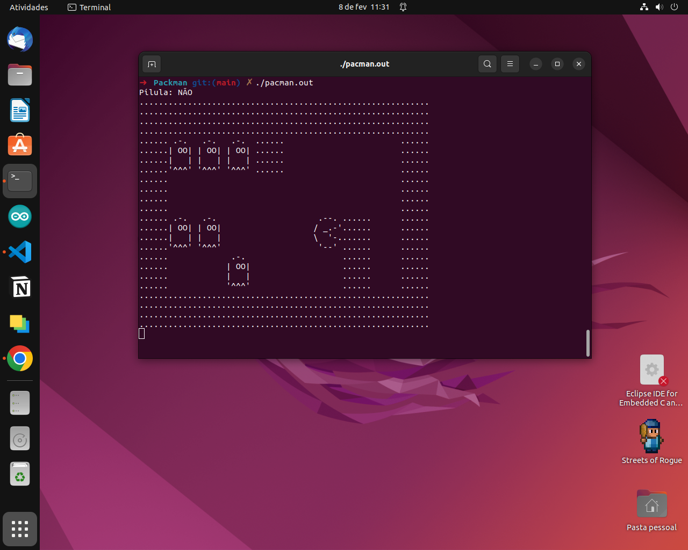

# Pacman Command Line 🟡◽◽◽◽



Pacman foi lançado em 22 de maio de 1980. A ideia do desenho original ocorreu durante um jantar com amigos, e deve-se a uma pizza sem uma fatia, que fazia lembrar uma boca aberta; assim tem origem uma personagem inspirada em Paku, uma personagem popular no Japão conhecido pelo seu apetite.

O objetivo do jogo é comer todas as pastilhas do labirinto sem ser atingido pelos fantasmas. Ao colidir com uma pastilha o PACMAN a engole e a mesma deve desaparecer do labirinto. Caso o jogador coma todas as pastilhas de um labirinto, o jogador passa de fase.

Para jogar o jogo pela linha de comando basta executar o arquivo ```pacman.out``` pela linha de comando:
```sh
    ./pacman.out
```

Caso queira fazer alguma alteração no código ou implementar outro mapa recomendamos que recompile o código através do terminal utilizando:
```sh
    gcc pacman.c mapa.c ui.c -o pacman.out   
```
e posteriormente execute o arquivo já compilado.

<hr>

<h3>Informaçẽs para contato</h3>

[](https://maresduardo420@gmail.com) [](https://api.whatsapp.com/send?phone=5534999739226&text=Ol%C3%A1%2C%20tudo%20bem%3F%3F%20Vim%20do%20GitHub%20e%20gostaria%20de%20falar%20com%20voc%C3%AA) [](https://instagram.com/___marcaobr) [](https://www.linkedin.com/in/marcosawe/)
